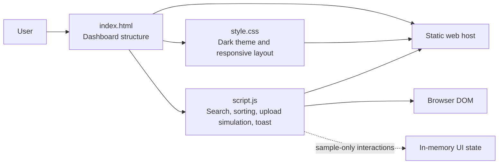

# CloudVault — Secure Cloud Storage Dashboard

CloudVault is a responsive, dark-themed cloud-storage dashboard prototype built with plain HTML, CSS, and JavaScript. It gives users a polished view of their files, storage allocation, and recent workspace activity, and demonstrates the upload flow without requiring a server or account.

> **Prototype scope:** The dashboard uses illustrative sample data. Upload is a front-end simulation; selected files are not transferred to a cloud bucket or persisted. The interface is suitable for static hosting, while real authentication, durable file storage, and multi-user data require a backend or a carefully configured object-storage integration.

## Screenshots

The screenshots below show the project running locally at desktop and mobile viewport sizes. They are placeholders until captured from a browser session.

### Desktop dashboard

<!-- Add screenshots/cloudvault-desktop.png after capturing a real desktop browser screenshot. -->

### Mobile dashboard

<!-- Add screenshots/cloudvault-mobile.png after capturing a real mobile browser screenshot. -->

## Features

- **Storage overview:** Summary cards, a 72% usage ring, and a category breakdown for documents, media, projects, and other files.
- **Recent files:** A sample file list with file type, size, owner, and last-updated time.
- **Search:** Filters the visible sample files as the user types.
- **Upload simulation:** Opens a file picker, displays selected file names and sizes, then shows simulated upload status feedback. It does not transmit file contents.
- **Activity feed:** Sample upload, sharing, and security events.
- **Storage progress:** Sidebar capacity bar and detailed usage indicator.
- **Responsive layout:** Dashboard cards and file rows adapt for tablet and mobile widths.
- **Static-site friendly:** No build step, package manager, API server, or runtime configuration is required.

## Architecture



### Project files

| File | Responsibility |
| --- | --- |
| `index.html` | Page structure, dashboard content, sample files, activity feed, and upload dialog. |
| `style.css` | Dark visual theme, dashboard layout, storage indicators, modal, and responsive breakpoints. |
| `script.js` | Browser-side event handlers for search, file selection display, simulated upload, sorting, and toast messages. |
| `screenshots/` | Screenshots of the running dashboard included in this README. |

### Runtime and data flow

The browser loads `index.html`; its stylesheet and script are referenced with relative paths, so the directory can be served from a static origin or a subdirectory. JavaScript selects and updates existing DOM elements directly. Sample dashboard values are authored in the HTML. There is no framework, bundler, database, authentication provider, or cloud SDK in the current implementation.

## Run locally

### Option 1: Open the page

Open `index.html` in a modern browser.

### Option 2: Serve the folder over HTTP

From this directory, run either command:

```bash
python -m http.server 8000
```

or, with Node.js installed:

```bash
npx serve .
```

Then visit [http://localhost:8000](http://localhost:8000) (or the address printed by `serve`). Serving over HTTP is closer to how the static site will run after deployment.

## Static hosting and S3-compatible deployment

The site consists of static assets, so it can be published to Amazon S3 static website hosting or another S3-compatible object-storage service that supports website hosting. The deployment target should serve `index.html` as its index document and return the CSS, JavaScript, and screenshot assets under their matching paths.

For an S3-compatible setup:

1. Create a bucket or static-site container with a unique name.
2. Upload `index.html`, `style.css`, `script.js`, and `screenshots/` while preserving the directory layout.
3. Configure the provider's website/static-site feature with `index.html` as the index document.
4. Set the site origin's access policy and MIME types according to the provider's documentation. Prefer a CDN and HTTPS for a public site.
5. Open the deployed site and check the browser console and network panel for failed asset requests.

**Security note:** A public static website is public to visitors. Never put cloud credentials, private data, secrets, or privileged bucket credentials in browser JavaScript. A real private file-storage product needs authentication and server-mediated access (for example, short-lived signed upload/download URLs), plus explicit bucket/CORS/access-policy configuration. This prototype does not implement those controls.

## Current limitations

- Dashboard metrics and activity entries are demo values, not live account data.
- Upload selection and completion feedback are simulated; files are not uploaded, saved, or virus-scanned.
- Search and sorting act on the sample file rows currently in the page.
- Sign-in, sharing permissions, notifications, billing, persistence, and backend APIs are not implemented.

## Possible next steps

1. Add an API and identity layer for users and file metadata.
2. Store objects in a private S3-compatible bucket and issue short-lived signed URLs from a trusted backend.
3. Derive storage totals, categories, recent files, and activity from persisted data.
4. Add resumable uploads, validation, error states, and security scanning.
5. Add automated accessibility and cross-browser checks as the app grows.

## License

No license has been added yet. Add a `LICENSE` file before granting others explicit reuse rights.


