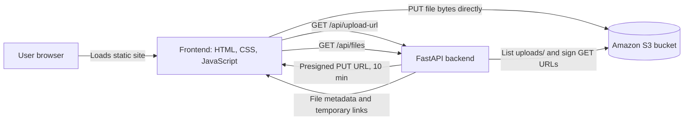

# CloudVault — Real AWS S3 Storage Dashboard

CloudVault is a dark, responsive cloud-storage dashboard backed by a FastAPI service and Amazon S3. The updated version replaces the earlier front-end upload simulation with a real browser-to-S3 upload flow: FastAPI creates a short-lived presigned URL, and the browser sends the selected file directly to S3.

> **Current deployment status:** The repository contains the application code and setup instructions. Before the upload flow can work, configure an S3 bucket, AWS credentials or an IAM role for the backend, CORS, and the API URL in `frontend/script.js`. The checked-in API URL is a placeholder. The app does not implement user sign-in or per-user authorization, so treat it as a learning prototype and do not put private user files behind it as-is.

## Screenshots

No screenshots of the running application are included yet.

## Features

- **Real S3 upload flow:** Pick one file; the frontend asks FastAPI for a presigned `PUT` URL, then uploads the file bytes from the browser to S3.
- **S3-backed file list:** Fetches objects stored under the `uploads/` prefix and shows object key, last modified time, and size.
- **Temporary download links:** The API creates a short-lived presigned `GET` URL for each listed object.
- **Dashboard summary:** Displays live file count and total size calculated from the API response.
- **Refresh and status feedback:** Reload the file list and see upload progress, success, or error feedback.
- **Responsive dark interface:** Sidebar and cards adapt to narrower viewports.
- **Static frontend and separate API:** Host the frontend as static website files and run the FastAPI service separately.

## Architecture



The FastAPI service holds the AWS SDK identity and signs requests. The browser receives temporary, object-scoped URLs; it does not receive AWS access keys. The S3 CORS policy must allow the website origin to make the signed `PUT` request.

## Repository layout

```text
CloudVault/
├── frontend/
│   ├── index.html       # Dashboard structure and content
│   ├── style.css        # Dark theme and responsive layout
│   └── script.js        # API calls, upload flow, file list, UI feedback
├── backend/
│   ├── main.py          # FastAPI health, presign, and list endpoints
│   ├── requirements.txt # Python dependencies
│   └── s3-cors.json     # Example bucket CORS configuration
└── README.md
```

## Requirements

- Python 3.10 or newer
- An AWS account and an S3 bucket in the configured region
- AWS credentials for local development, or preferably an IAM role attached to the backend compute (for example, EC2)
- A static hosting origin for the frontend when deploying it

## Configure AWS and start the API locally

### 1. Create and configure the bucket

Create an S3 bucket and note its name and AWS region. Apply the CORS configuration from `backend/s3-cors.json` in **S3 → Bucket → Permissions → Cross-origin resource sharing (CORS)**.

The checked-in example uses `AllowedOrigins: ["*"]` for learning. For a deployed site, replace `*` with the exact website origin (for example, `https://your-site.example`) and keep only the methods and headers the browser flow needs. The browser sends a `PUT`; the API uses S3 operations server-side.

### 2. Give the backend an AWS identity

For local development, configure the standard AWS credential chain (for example, `aws configure` or environment variables). On EC2, prefer an instance profile / IAM role over static access keys.

The backend identity needs permissions scoped to this bucket:

- `s3:PutObject` on `arn:aws:s3:::YOUR_BUCKET/uploads/*` to sign uploads.
- `s3:GetObject` on `arn:aws:s3:::YOUR_BUCKET/uploads/*` to sign temporary downloads.
- `s3:ListBucket` on `arn:aws:s3:::YOUR_BUCKET`, ideally constrained to the `uploads/` prefix.

Do not place AWS keys in frontend JavaScript, commit credentials, or make the bucket public just to enable uploads.

### 3. Set backend environment variables

Create `backend/.env` (it is intentionally not committed):

```dotenv
AWS_REGION=ap-south-1
S3_BUCKET=your-unique-bucket-name
```

The backend loads `.env` from its working directory and raises an error on startup if `S3_BUCKET` is missing. Ensure your AWS SDK credential chain is configured as described above. Never commit `.env` or credentials.

### 4. Install dependencies and run FastAPI

From the repository root, in PowerShell:

```powershell
py -m venv backend\.venv
.\backend\.venv\Scripts\Activate.ps1
py -m pip install -r backend\requirements.txt
Set-Location backend
uvicorn main:app --reload --host 127.0.0.1 --port 8000
```

Check the health endpoint at `http://127.0.0.1:8000/health`; a healthy response is `{"status":"ok","service":"cloudvault-s3-api"}`. The current permissive CORS setting supports local learning, but should be restricted before deployment.

## Configure and run the frontend

In `frontend/script.js`, set `API_BASE_URL` to the reachable API origin. For local use, set it to:

```js
const API_BASE_URL = "http://127.0.0.1:8000";
```

Serve the `frontend/` directory over HTTP. From the repository root, one option is:

```powershell
py -m http.server 5500 --directory frontend
```

Open `http://127.0.0.1:5500`. Opening the HTML directly with `file://` is not a reliable deployment setup: browsers apply CORS and origin rules to the API and S3 requests.

## Deploy the frontend to S3-compatible static hosting

1. Upload the contents of `frontend/` (not the whole repository) to the configured static website origin, preserving `index.html`, `style.css`, and `script.js` together.
2. Set `frontend/script.js` `API_BASE_URL` to the public HTTPS origin for FastAPI.
3. Configure FastAPI CORS with that exact frontend origin.
4. Configure the S3 bucket CORS to allow the same frontend origin for the signed browser `PUT` request.
5. Keep the S3 bucket private. Let the backend IAM identity list objects and create presigned URLs.
6. Prefer HTTPS for both the frontend and API (for example, a CDN in front of the static site and an HTTPS-enabled API endpoint). Avoid exposing a public EC2 HTTP API for production use.
7. Verify `/health`, file listing, upload, and temporary download from the deployed site; inspect browser console/network errors if a request fails.

S3 static website endpoints are commonly HTTP-only. For a production HTTPS site, put a CDN or another HTTPS frontend in front of the static origin and configure the API separately with HTTPS.

## API reference

| Method and path | Purpose | Notes |
| --- | --- | --- |
| `GET /health` | Check service availability. | Does not verify that an S3 operation will succeed. |
| `GET /api/upload-url?filename=...&content_type=...` | Create an upload key under `uploads/` and return a presigned S3 `PUT` URL. | URL expires after 600 seconds. The browser must send the matching `Content-Type`. |
| `GET /api/files` | List objects under `uploads/` and return metadata with temporary download links. | Download URLs expire after 600 seconds. |

## Upload and file-list flow

1. The user chooses one file using the browser file picker.
2. `frontend/script.js` requests `/api/upload-url` with the filename and content type.
3. FastAPI creates a timestamped key under `uploads/` and asks boto3 for a ten-minute presigned `PutObject` URL.
4. The browser sends the file directly to S3 with `PUT` and the matching content type.
5. The frontend requests `/api/files`; FastAPI lists bucket objects and generates temporary presigned `GetObject` links.
6. The dashboard renders the returned key, date, size, file count, and total storage size.

## Current limitations and security considerations

- There is no authentication, user model, or ownership check. Anyone who can reach the API may request upload URLs and list uploaded objects. Add authentication and authorization before using this with real users or private files.
- `API_BASE_URL` is still `http://YOUR-BACKEND-IP:8000`; change it before running/deploying.
- Backend CORS currently allows every origin (`*`). Restrict it to the frontend origin for deployment; CORS is not a substitute for authentication.
- Bucket CORS also currently allows every origin; restrict it as above.
- The list endpoint uses one `list_objects_v2` response and does not paginate beyond S3's first page of results.
- The UI lets the user select one file at a time. There are no multipart/resumable uploads, file-size/type policy, malware scanning, or quota enforcement.
- Sample values are not shown as fallback when the backend is unreachable; the interface reports a connection error.
- Uploading a file with an existing timestamped key could overwrite that object. A production service should use collision-resistant object keys and validate names/content types and size server-side.
- Do not enable public bucket access to make presigned downloads work; the download links are temporary signed URLs.

## Troubleshooting

- **Backend fails with `S3_BUCKET is missing`:** Create `backend/.env` with `AWS_REGION` and `S3_BUCKET`, then start Uvicorn with `backend/` as the working directory.
- **AWS `AccessDenied`:** Check the backend's active IAM identity and its `PutObject`, `GetObject`, and `ListBucket` permissions, including the `uploads/` prefix.
- **Browser reports CORS:** Check both API CORS and bucket CORS. The website origin, allowed `PUT` method, and allowed request headers must match the browser request.
- **Frontend cannot connect:** Replace the placeholder in `frontend/script.js`, confirm FastAPI is reachable, and verify that the configured protocol and port are correct.
- **Upload URL succeeds but S3 `PUT` fails:** Ensure the frontend sends the exact `Content-Type` used when creating the presigned URL and that bucket CORS allows it.


